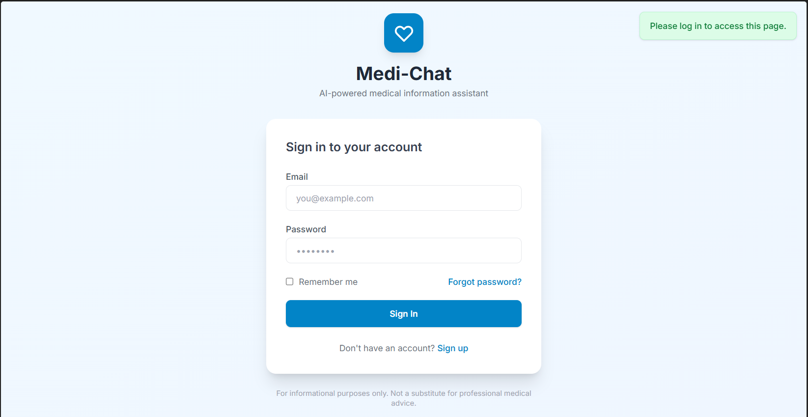

#  Medi-Chat: An AI-Powered Chatbot to Provide Medical Information




## About the Project
Medi-Chat is an AI-powered chatbot designed to provide medical information and answer health-related queries. The system leverages Large Language Models (LLMs) and Retrieval-Augmented Generation (RAG) techniques to deliver accurate and context-aware responses.

## Prerequisites
- Python 3.10+
- A [Pinecone](https://pinecone.io) account with a **serverless index** (dimension: **384**, metric: **cosine**)
- A [Google AI Studio](https://aistudio.google.com) Gemini API key

---

## 1. Install dependencies
```bash
pip install -r requirements.txt
```

## 2. Configure environment variables
```bash
cp .env.example .env
```
Edit `.env` and fill in:
```
GEMINI_API_KEY=your_gemini_key
PINECONE_API_KEY=your_pinecone_key
PINECONE_INDEX_NAME=medi-chat        # must match your Pinecone index name
SECRET_KEY=any-long-random-string
```

## 3. Create the Pinecone index
In the Pinecone console, create a **serverless** index named `medi-chat`:
- Dimensions: **384**
- Metric: **cosine**

## 4. Ingest the medical PDF (run once)
```bash
python ingest.py --pdf Medical_book.pdf
```
This chunks the PDF, creates embeddings with `all-MiniLM-L6-v2`, and uploads them to Pinecone.

## 5. Run the app
```bash
python app.py
```
Open http://localhost:5000 — register an account and start chatting.

---

## Project structure
```
Medi-Chat/
├── app.py            # Flask app, routes, auth
├── config.py         # Config from .env
├── models.py         # SQLAlchemy models (User, ChatMessage)
├── rag.py            # RAG pipeline (Pinecone + Gemini)
├── ingest.py         # One-time PDF ingestion script
├── requirements.txt
├── .env.example
└── templates/
    ├── base.html
    ├── login.html
    ├── signup.html
    └── chat.html
```
